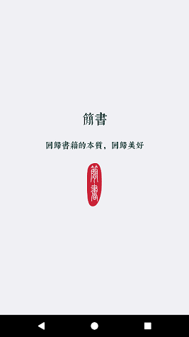
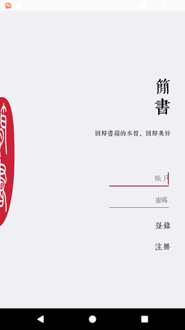
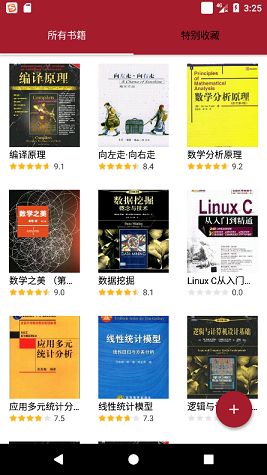

# 简书

## Introduction
>简书，基于豆瓣API的安卓APP。

>Jianshu, an aAndroid app based on Douban API.

>旨在帮助用户记录接触到或者阅读过的书籍，并且记录读者关于每本书的随感或者回忆。

>Designed to help users record what they have seen or read, and to record the reader's notes or memories about each book.

>基于中国风的UI设计，完成了必要的个人图书管理与分享功能。

>Based on the Chinese style UI design, completed the necessary personal library management and sharing capabilities.

>服务器端基于阿里云提供的服务器，利用Python+Flask+Mysql形成后台服务器框架，保存用户数据和实现同步功能。

>Server based on the server provided by Aliyun, the use of Python + Flask + Mysql form a background server framework to save user data and to achieve synchronization.

## Dependency
### Local
1. Android SDK(>6.0)
2. Connected network environment
3. Storage space of more than 10M 
### Server
1. Open the appropriate server port for client requests

## Rebuild
1. Import the project files
2. Rebuild the project according existing compilation rules. Ensure the versions of SDK and BUILD TOOLS are corresponding
3. Compile and run

## Loading interface

## Login interface

## Main interface

